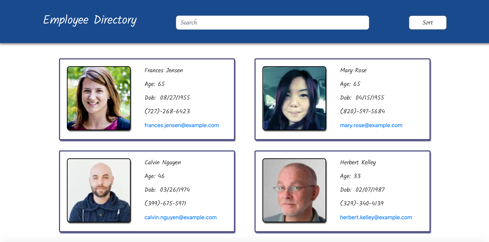

# React-Employee-Directory



## Description

For this project I had to go and build a simple Employee Directory app from scratch using React. The employee's are auto generated from the [randomuser.me](https://randomuser.me) API. The app allows the user to see all of the employees in the directory at a glance. You can also sort by name or age, or you can search by first name, last name, age, or birth date. This project is currently live on github pages, [click here to check it out!]()

## Table of contents

* [Installation](#installation)

* [Questions](#questions)

* [License](#license)

## Installation

>To install the needed dependencies, run this command:

```
npm i
```

## Questions

If you have any questions, please open an issue or contact [Faduma Abdillahi](https://github.com/Faduma92).

## License
Copyright (c) Faduma Abdillahi All rights reserved.
